<picture>
	<source media="(prefers-color-scheme: dark)" srcset="./stats/stats-dark.svg">
	
</picture>
 
<picture>
	<source media="(prefers-color-scheme: dark)" srcset="./stats/top-langs-dark.svg">
	
</picture>
 
<picture>
	<source media="(prefers-color-scheme: dark)" srcset="https://github-widgetbox.vercel.app/api/skills?languages=js%2Cpython%2Creact%2Chtml%2Ccss%2Cbootstrap%2Ctailwind&includeNames=true&theme=darkmode">
	
</picture>

### 📋 [CV](https://superzombi.github.io/resume/v2/)

### ☕ [Buy me coffee](https://donatello.to/super_zombi)

	

		<h2> Extensions</h2>
	

<a href="https://github.com/SuperZombi/Picture-in-Picture-for-Youtube">
	<picture>
		<source media="(prefers-color-scheme: dark)" srcset="./stats/pins/Picture-in-Picture-for-Youtube-dark.svg"/>
		
	</picture>
</a>
<a href="https://github.com/SuperZombi/HDrezka-Helper">
	<picture>
		<source media="(prefers-color-scheme: dark)" srcset="./stats/pins/HDrezka-Helper-dark.svg"/>
		
	</picture>
</a>
<a href="https://github.com/SuperZombi/telegram-downloader">
	<picture>
		<source media="(prefers-color-scheme: dark)" srcset="./stats/pins/telegram-downloader-dark.svg"/>
		
	</picture>
</a>
<a href="https://github.com/SuperZombi/genshin-resin">
	<picture>
		<source media="(prefers-color-scheme: dark)" srcset="./stats/pins/genshin-resin-dark.svg"/>
		
	</picture>
</a>
<a href="https://github.com/SuperZombi/Google-Meet-Helper">
	<picture>
		<source media="(prefers-color-scheme: dark)" srcset="./stats/pins/Google-Meet-Helper-dark.svg"/>
		
	</picture>
</a>
<a href="https://github.com/SuperZombi/Instagram-Helper">
	<picture>
		<source media="(prefers-color-scheme: dark)" srcset="./stats/pins/Instagram-Helper-dark.svg"/>
		
	</picture>
</a>

	

		<h2> Applications</h2>
	

<a href="https://github.com/SuperZombi/MyTube-GUI">
	<picture>
		<source media="(prefers-color-scheme: dark)" srcset="./stats/pins/MyTube-GUI-dark.svg"/>
		
	</picture>
</a>
<a href="https://github.com/SuperZombi/GICutscenesUI">
	<picture>
		<source media="(prefers-color-scheme: dark)" srcset="./stats/pins/GICutscenesUI-dark.svg"/>
		
	</picture>
</a>
<a href="https://github.com/SuperZombi/melody-monitor">
	<picture>
		<source media="(prefers-color-scheme: dark)" srcset="./stats/pins/melody-monitor-dark.svg"/>
		
	</picture>
</a>
<a href="https://github.com/SuperZombi/Discord-Presence">
	<picture>
		<source media="(prefers-color-scheme: dark)" srcset="./stats/pins/Discord-Presence-dark.svg"/>
		
	</picture>
</a>
<a href="https://github.com/SuperZombi/Discord-Music-Status">
	<picture>
		<source media="(prefers-color-scheme: dark)" srcset="./stats/pins/Discord-Music-Status-dark.svg"/>
		
	</picture>
</a>
<a href="https://github.com/SuperZombi/soundpad-online">
	<picture>
		<source media="(prefers-color-scheme: dark)" srcset="./stats/pins/soundpad-online-dark.svg"/>
		
	</picture>
</a>
<a href="https://github.com/SuperZombi/pypi-uploader">
	<picture>
		<source media="(prefers-color-scheme: dark)" srcset="./stats/pins/pypi-uploader-dark.svg"/>
		
	</picture>
</a>
<a href="https://github.com/SuperZombi/fast-server">
	<picture>
		<source media="(prefers-color-scheme: dark)" srcset="./stats/pins/fast-server-dark.svg"/>
		
	</picture>
</a>
<a href="https://github.com/SuperZombi/m3u8-downloader">
	<picture>
		<source media="(prefers-color-scheme: dark)" srcset="./stats/pins/m3u8-downloader-dark.svg"/>
		
	</picture>
</a>
<a href="https://github.com/SuperZombi/Telegram_Cloud">
	<picture>
		<source media="(prefers-color-scheme: dark)" srcset="./stats/pins/Telegram_Cloud-dark.svg"/>
		
	</picture>
</a>
<a href="https://github.com/SuperZombi/roomix">
	<picture>
		<source media="(prefers-color-scheme: dark)" srcset="./stats/pins/roomix-dark.svg"/>
		
	</picture>
</a>

	

		<h2> Games</h2>
	

<a href="https://github.com/SuperZombi/wot-modpack">
	<picture>
		<source media="(prefers-color-scheme: dark)" srcset="./stats/pins/wot-modpack-dark.svg"/>
		
	</picture>
</a>
<a href="https://github.com/SuperZombi/dust2">
	<picture>
		<source media="(prefers-color-scheme: dark)" srcset="./stats/pins/dust2-dark.svg"/>
		
	</picture>
</a>
<a href="https://github.com/SuperZombi/visual_novel">
	<picture>
		<source media="(prefers-color-scheme: dark)" srcset="./stats/pins/visual_novel-dark.svg"/>
		
	</picture>
</a>
<a href="https://github.com/SuperZombi/monty_hall">
	<picture>
		<source media="(prefers-color-scheme: dark)" srcset="./stats/pins/monty_hall-dark.svg"/>
		
	</picture>
</a>
<a href="https://github.com/SuperZombi/chess-rpg">
	<picture>
		<source media="(prefers-color-scheme: dark)" srcset="./stats/pins/chess-rpg-dark.svg"/>
		
	</picture>
</a>
<a href="https://github.com/SuperZombi/card-game">
	<picture>
		<source media="(prefers-color-scheme: dark)" srcset="./stats/pins/card-game-dark.svg"/>
		
	</picture>
</a>

	

		<h2> Python Libraries</h2>
	

<a href="https://github.com/SuperZombi/MyTube">
	<picture>
		<source media="(prefers-color-scheme: dark)" srcset="./stats/pins/MyTube-dark.svg"/>
		
	</picture>
</a>
<a href="https://github.com/SuperZombi/HdRezkaApi">
	<picture>
		<source media="(prefers-color-scheme: dark)" srcset="./stats/pins/HdRezkaApi-dark.svg"/>
		
	</picture>
</a>
<a href="https://github.com/SuperZombi/DBNavigator">
	<picture>
		<source media="(prefers-color-scheme: dark)" srcset="./stats/pins/DBNavigator-dark.svg"/>
		
	</picture>
</a>
<a href="https://github.com/SuperZombi/Web-Console">
	<picture>
		<source media="(prefers-color-scheme: dark)" srcset="./stats/pins/Web-Console-dark.svg"/>
		
	</picture>
</a>
<a href="https://github.com/SuperZombi/PyEasyDownloader">
	<picture>
		<source media="(prefers-color-scheme: dark)" srcset="./stats/pins/PyEasyDownloader-dark.svg"/>
		
	</picture>
</a>

	

		<h2> JavaScript Libraries</h2>
	

<a href="https://github.com/SuperZombi/Notification_JS">
	<picture>
		<source media="(prefers-color-scheme: dark)" srcset="./stats/pins/Notification_JS-dark.svg"/>
		
	</picture>
</a>
<a href="https://github.com/SuperZombi/SwipeMenu_JS">
	<picture>
		<source media="(prefers-color-scheme: dark)" srcset="./stats/pins/SwipeMenu_JS-dark.svg"/>
		
	</picture>
</a>

