<picture>
	<source media="(prefers-color-scheme: dark)" srcset="./stats/stats-dark.svg">
	
</picture>
 
<picture>
	<source media="(prefers-color-scheme: dark)" srcset="./stats/langs-dark.svg">
	
</picture>

### 

### 📋Resume

💼 [New resume](https://superzombi.github.io/resume/v2/)

✨ [Old resume](https://superzombi.github.io/resume/?true)

### ☕ [Buy me coffee](https://donatello.to/super_zombi)

	

		<h2> Extensions</h2>
	

<a href="https://github.com/SuperZombi/Picture-in-Picture-for-Youtube">
	<picture>
		<source media="(prefers-color-scheme: dark)" srcset="https://github-readme-stats.vercel.app/api/pin/?username=SuperZombi&repo=Picture-in-Picture-for-Youtube&border_radius=15&theme=dark"/>
		
	</picture>
</a>
<a href="https://github.com/SuperZombi/HDrezka-Helper">
	<picture>
		<source media="(prefers-color-scheme: dark)" srcset="https://github-readme-stats.vercel.app/api/pin/?username=SuperZombi&repo=HDrezka-Helper&border_radius=15&theme=dark"/>
		
	</picture>
</a>
<a href="https://github.com/SuperZombi/telegram-downloader">
	<picture>
		<source media="(prefers-color-scheme: dark)" srcset="https://github-readme-stats.vercel.app/api/pin/?username=SuperZombi&repo=telegram-downloader&border_radius=15&theme=dark"/>
		
	</picture>
</a>
<a href="https://github.com/SuperZombi/genshin-resin">
	<picture>
		<source media="(prefers-color-scheme: dark)" srcset="https://github-readme-stats.vercel.app/api/pin/?username=SuperZombi&repo=genshin-resin&border_radius=15&theme=dark"/>
		
	</picture>
</a>
<a href="https://github.com/SuperZombi/Google-Meet-Helper">
	<picture>
		<source media="(prefers-color-scheme: dark)" srcset="https://github-readme-stats.vercel.app/api/pin/?username=SuperZombi&repo=Google-Meet-Helper&border_radius=15&theme=dark"/>
		
	</picture>
</a>
<a href="https://github.com/SuperZombi/Instagram-Helper">
	<picture>
		<source media="(prefers-color-scheme: dark)" srcset="https://github-readme-stats.vercel.app/api/pin/?username=SuperZombi&repo=Instagram-Helper&border_radius=15&theme=dark"/>
		
	</picture>
</a>

	

		<h2> Applications</h2>
	

<a href="https://github.com/SuperZombi/MyTube-GUI">
	<picture>
		<source media="(prefers-color-scheme: dark)" srcset="https://github-readme-stats.vercel.app/api/pin/?username=SuperZombi&repo=MyTube-GUI&border_radius=15&theme=dark"/>
		
	</picture>
</a>
<a href="https://github.com/SuperZombi/GICutscenesUI">
	<picture>
		<source media="(prefers-color-scheme: dark)" srcset="https://github-readme-stats.vercel.app/api/pin/?username=SuperZombi&repo=GICutscenesUI&border_radius=15&theme=dark"/>
		
	</picture>
</a>
<a href="https://github.com/SuperZombi/melody-monitor">
	<picture>
		<source media="(prefers-color-scheme: dark)" srcset="https://github-readme-stats.vercel.app/api/pin/?username=SuperZombi&repo=melody-monitor&border_radius=15&theme=dark"/>
		
	</picture>
</a>
<a href="https://github.com/SuperZombi/Discord-Presence">
	<picture>
		<source media="(prefers-color-scheme: dark)" srcset="https://github-readme-stats.vercel.app/api/pin/?username=SuperZombi&repo=Discord-Presence&border_radius=15&theme=dark"/>
		
	</picture>
</a>
<a href="https://github.com/SuperZombi/Discord-Music-Status">
	<picture>
		<source media="(prefers-color-scheme: dark)" srcset="https://github-readme-stats.vercel.app/api/pin/?username=SuperZombi&repo=Discord-Music-Status&border_radius=15&theme=dark"/>
		
	</picture>
</a>
<a href="https://github.com/SuperZombi/soundpad-online">
	<picture>
		<source media="(prefers-color-scheme: dark)" srcset="https://github-readme-stats.vercel.app/api/pin/?username=SuperZombi&repo=soundpad-online&border_radius=15&theme=dark"/>
		
	</picture>
</a>
<a href="https://github.com/SuperZombi/Pypi-uploader">
	<picture>
		<source media="(prefers-color-scheme: dark)" srcset="https://github-readme-stats.vercel.app/api/pin/?username=SuperZombi&repo=pypi-uploader&border_radius=15&theme=dark"/>
		
	</picture>
</a>
<a href="https://github.com/SuperZombi/fast-server">
	<picture>
		<source media="(prefers-color-scheme: dark)" srcset="https://github-readme-stats.vercel.app/api/pin/?username=SuperZombi&repo=fast-server&border_radius=15&theme=dark"/>
		
	</picture>
</a>
<a href="https://github.com/SuperZombi/m3u8-downloader">
	<picture>
		<source media="(prefers-color-scheme: dark)" srcset="https://github-readme-stats.vercel.app/api/pin/?username=SuperZombi&repo=m3u8-downloader&border_radius=15&theme=dark"/>
		
	</picture>
</a>
<a href="https://github.com/SuperZombi/Telegram_Cloud">
	<picture>
		<source media="(prefers-color-scheme: dark)" srcset="https://github-readme-stats.vercel.app/api/pin/?username=SuperZombi&repo=Telegram_Cloud&border_radius=15&theme=dark"/>
		
	</picture>
</a>
<a href="https://github.com/SuperZombi/roomix">
	<picture>
		<source media="(prefers-color-scheme: dark)" srcset="https://github-readme-stats.vercel.app/api/pin/?username=SuperZombi&repo=roomix&border_radius=15&theme=dark"/>
		
	</picture>
</a>

	

		<h2> Games</h2>
	

<a href="https://github.com/SuperZombi/wot-modpack">
	<picture>
		<source media="(prefers-color-scheme: dark)" srcset="https://github-readme-stats.vercel.app/api/pin/?username=SuperZombi&repo=wot-modpack&border_radius=15&theme=dark"/>
		
	</picture>
</a>
<a href="https://github.com/SuperZombi/dust2">
	<picture>
		<source media="(prefers-color-scheme: dark)" srcset="https://github-readme-stats.vercel.app/api/pin/?username=SuperZombi&repo=dust2&border_radius=15&theme=dark"/>
		
	</picture>
</a>
<a href="https://github.com/SuperZombi/visual_novel">
	<picture>
		<source media="(prefers-color-scheme: dark)" srcset="https://github-readme-stats.vercel.app/api/pin/?username=SuperZombi&repo=visual_novel&border_radius=15&theme=dark"/>
		
	</picture>
</a>
<a href="https://github.com/SuperZombi/monty_hall">
	<picture>
		<source media="(prefers-color-scheme: dark)" srcset="https://github-readme-stats.vercel.app/api/pin/?username=SuperZombi&repo=monty_hall&border_radius=15&theme=dark"/>
		
	</picture>
</a>
<a href="https://github.com/SuperZombi/chess-rpg">
	<picture>
		<source media="(prefers-color-scheme: dark)" srcset="https://github-readme-stats.vercel.app/api/pin/?username=SuperZombi&repo=chess-rpg&border_radius=15&theme=dark"/>
		
	</picture>
</a>
<a href="https://github.com/SuperZombi/card-game">
	<picture>
		<source media="(prefers-color-scheme: dark)" srcset="https://github-readme-stats.vercel.app/api/pin/?username=SuperZombi&repo=card-game&border_radius=15&theme=dark"/>
		
	</picture>
</a>

	

		<h2> Python Libraries</h2>
	

<a href="https://github.com/SuperZombi/MyTube">
	<picture>
		<source media="(prefers-color-scheme: dark)" srcset="https://github-readme-stats.vercel.app/api/pin/?username=SuperZombi&repo=MyTube&border_radius=15&theme=dark"/>
		
	</picture>
</a>
<a href="https://github.com/SuperZombi/HdRezkaApi">
	<picture>
		<source media="(prefers-color-scheme: dark)" srcset="https://github-readme-stats.vercel.app/api/pin/?username=SuperZombi&repo=HdRezkaApi&border_radius=15&theme=dark"/>
		
	</picture>
</a>
<a href="https://github.com/SuperZombi/DBNavigator">
	<picture>
		<source media="(prefers-color-scheme: dark)" srcset="https://github-readme-stats.vercel.app/api/pin/?username=SuperZombi&repo=DBNavigator&border_radius=15&theme=dark"/>
		
	</picture>
</a>
<a href="https://github.com/SuperZombi/Web-Console">
	<picture>
		<source media="(prefers-color-scheme: dark)" srcset="https://github-readme-stats.vercel.app/api/pin/?username=SuperZombi&repo=Web-Console&border_radius=15&theme=dark"/>
		
	</picture>
</a>
<a href="https://github.com/SuperZombi/PyEasyDownloader">
	<picture>
		<source media="(prefers-color-scheme: dark)" srcset="https://github-readme-stats.vercel.app/api/pin/?username=SuperZombi&repo=PyEasyDownloader&border_radius=15&theme=dark"/>
		
	</picture>
</a>

	

		<h2> JavaScript Libraries</h2>
	

<a href="https://github.com/SuperZombi/Notification_JS">
	<picture>
		<source media="(prefers-color-scheme: dark)" srcset="https://github-readme-stats.vercel.app/api/pin/?username=SuperZombi&repo=Notification_JS&border_radius=15&theme=dark"/>
		
	</picture>
</a>
<a href="https://github.com/SuperZombi/SwipeMenu_JS">
	<picture>
		<source media="(prefers-color-scheme: dark)" srcset="https://github-readme-stats.vercel.app/api/pin/?username=SuperZombi&repo=SwipeMenu_JS&border_radius=15&theme=dark"/>
		
	</picture>
</a>

